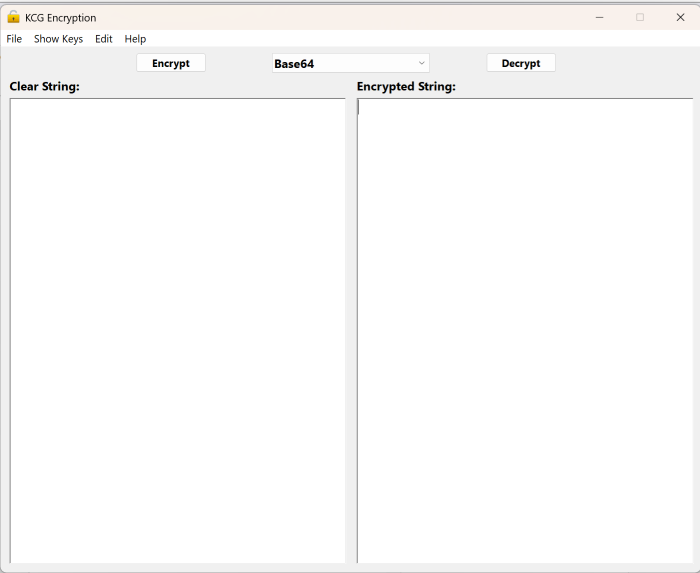

# KCG Encryption for XOJO

Written By: Kevin Cary-Grimm

This is an encryption module for XOJO that implements Base64, AES-256, RSA-2048, Hash256, Hash512, Blowfish(CBC), and RC4(ARC4). It also can generate secure passwords. It is using all native API 2.0 XOJO code and it’s built in crypto libraries. I needed a clear basic set of API 2.0 example code for these common encryptions/encodings. I’m place this out here hoping someone else finds it useful.

-   Version 1.2.0.0 was to add the RC4(ARC4) encryption. Thanks to Mike D.
-   This is version 1.3.0.0 to add the demonstration of generating a secure password.

My web site: <Http://KCG-Software.com>
