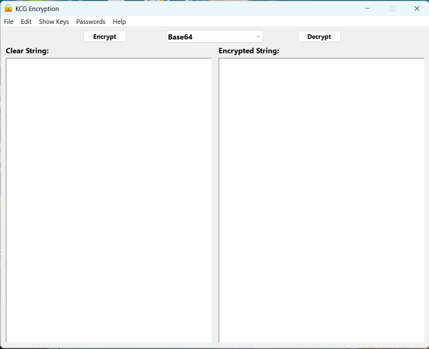

# KCG Encryption for XOJO

Written By: Kevin Cary-Grimm

This is an encryption module for XOJO that implements Base64, AES-256, RSA-2048, Hash256, Hash512, TwoFish, Blowfish (CBC), RC4 (ARC4), Quantum Resistant 512, Hybrid Quantum Resistant 1024, Bcrypt, SHA-256 and SHA3-256. It also can generate secure passwords. It is using all native API 2.0 XOJO code and it’s built in crypto libraries when possible. I needed a clear basic set of API 2.0 example code for these common encryptions/encodings. I’m placing this out here hoping someone else finds it useful.

-   Version 1.2.0.0 was to add the RC4(ARC4) encryption. Thanks to Mike D.
-   This is version 1.3.0.0 was to add the demonstration of generating a secure password.
-   This version 1.4.0.0 is to add 3 more encryptions. It now has TwoFish, Quantum Resistant 512, and Hybrid Quantum Resistant 1024 added into it.
-   This version 1.5.0.0 is to add Bcrypt. On Linux you may need to install apache2-utils for (Debian/Ubuntu/Mint) or httpd-tools for (CentOS/RHEL).
-   This version 1.6.0.0 is to add 2 more HASH encryptions. It now has SHA-256 and SHA3-256 added into it.

My web site: <Http://KCG-Software.com>
